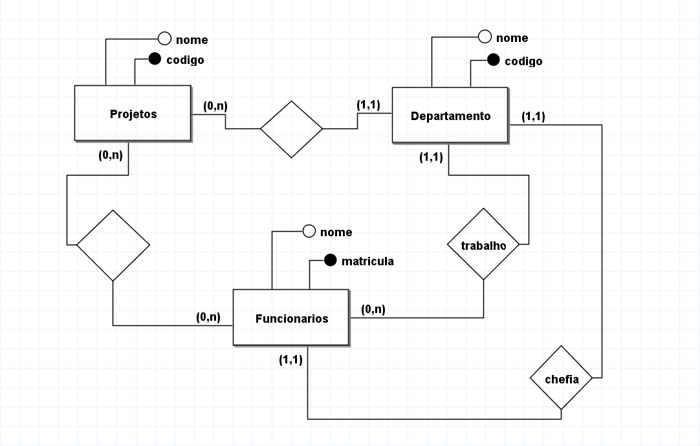

 

### Exercicio 1 
Uma construtora de grande porte deseja implementar um sistema e seus requisitos estão listado abaixo. Faça o modelo conceitual deles.

- A construtora possui projetos, departamentos e funcionários;
-   Um projeto tem um código e um nome; 
- Um departamento tem um nome e um código;
-  Um funcionário tem uma matrícula e um nome; 
- Um projeto é sempre coordenado por um departamento;
-  Um departamento pode coordenar mais de um projeto; 
-  Um funcionário está lotado num departamento e pode trabalhar em mais de um projeto;
-  Os departamentos possuem funcionários que são chefes

 

